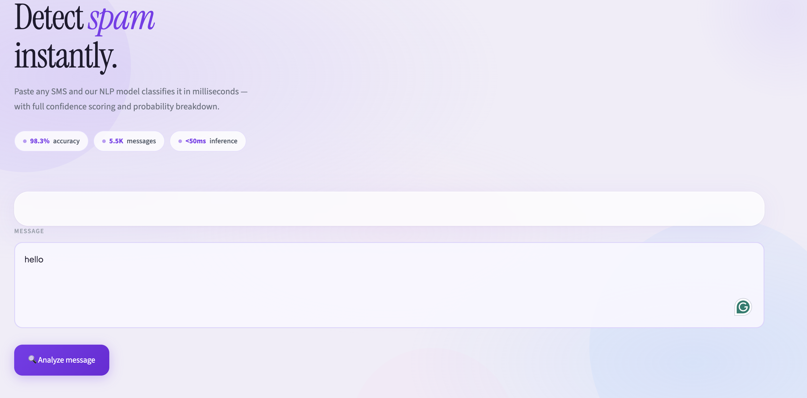
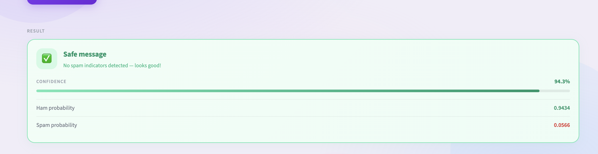

# SMS Spam Detection using NLP

## Project Overview

This project uses Natural Language Processing (NLP) and Machine Learning to classify SMS messages as Spam or Ham (Not Spam).

The model is trained using the SMS Spam Collection Dataset and uses TF-IDF Vectorization with a Multinomial Naive Bayes Classifier.

---

## Features

- SMS Spam Detection
- Text Preprocessing
- TF-IDF Vectorization
- Multinomial Naive Bayes Model
- Streamlit Web Application
- Interactive User Interface
- Real-time Prediction

---

## Dataset

Dataset: SMS Spam Collection Dataset

Total Messages: 5572

Classes:
- Ham
- Spam

---

## Technologies Used

- Python
- Pandas
- NumPy
- NLTK
- Scikit-Learn
- Streamlit
- Matplotlib
- Seaborn

---

## Model Performance

- Accuracy: ~98%
- Precision: High
- Recall: High
- F1 Score: High

---

## Project Structure
SMS-Spam-Detection/
│
├── data/
│   └── SMSSpamCollection
│
├── models/
│   ├── spam_model.pkl
│   └── vectorizer.pkl
│
├── notebooks/
│   └── spam_detection.ipynb
│
├── screenshots/
│   ├── home_page.png
│   ├── spam_prediction.png
│   └── ham_prediction.png
│
├── streamlit_app/
│   └── app.py
│
├── requirements.txt
│
└── README.md

---

## Installation

### Clone Repository

bash git clone <repository-url> cd SMS-Spam-Detection 

### Install Dependencies

bash pip install -r requirements.txt 

### Run Application

bash streamlit run streamlit_app/app.py 

---

## Workflow

1. Data Collection
2. Data Cleaning
3. Exploratory Data Analysis (EDA)
4. Text Preprocessing
5. Feature Extraction using TF-IDF
6. Model Training using Naive Bayes
7. Model Evaluation
8. Model Serialization using Pickle
9. Streamlit Deployment

---

## Screenshots

### Home Screen

### Spam Detection

### Safe Message Detection

## Future Improvements

- Deep Learning Models
- LSTM Based Spam Detection
- BERT Based Classification
- Email Spam Detection
- Multi-language Support

---

## Author

Karthik

Machine Learning & NLP Project